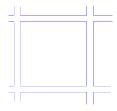
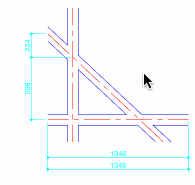

# Caad4Rhino

* verion 0.0.1  
* 版权 (c) 2019-2020 马海东
* 由ikuku.cn & caad.xyz 提供支持

### 简介

Caad4Rhino 是一个在[rhino三维软件](https://www.rhino3d.com)下用于计算机辅助建筑设计的python工具包.

### 功能特色

* 墙 
    * 画墙线
    * 单线变墙
    * 修剪相交的墙线: 包括L,X,T三种情况
* 门窗
    * 开窗
    * 开各种方向的门
* 尺寸标注
    * 拆分尺寸线
    * 合并尺寸线

### 如何安装?

* 创建以下文件夹   
**mac**:   
`~/Library/Application Support/McNeel/Rhinoceros/6.0/Plug-ins/PythonPlugIns/caad4rhino{417c9034-2152-48dc-b487-29b584c473a5}`  
**win**:   
`%APPDATA%\McNeel\Rhinoceros\6.0\Plug-ins\PythonPlugIns/caad4rhino{417c9034-2152-48dc-b487-29b584c473a5}`
* 拷贝 `dev` 文件夹到 `caad4rhino{417c9034-2152-48dc-b487-29b584c473a5}`
* 打开Rhino软件, 在命令行下输入`caad` 会打开帮助页.
* 在 `dev/alias.txt` 文件中你可以找到所有的命令,你也可以把这些快捷键导入到Rhino的快捷键环境中.  

>Note: Sometimes, Rhino requires that Python be loaded before it can see the new command for the first time in a session - running EditPythonScript, or any other python script should allow the command to work. 

### 如何使用?

### 许可证(LGPL-3.0)

You can redistribute it and/or modify it under the terms of the GNU Lesser General Public License version 3 as published by the Free Software Foundation.

### 更多信息

如果你有问题或想参与到caad4rhino的开发中， 你可以通过 [google mailing list](https://groups.google.com/d/forum/rhino4caad) 与作者联系.
