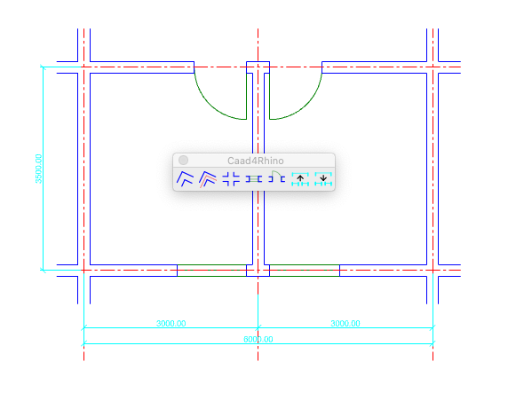
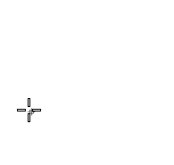
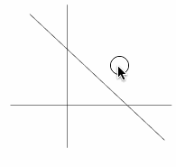
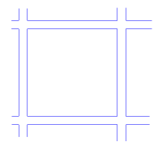
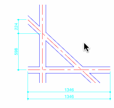

# Caad4Rhino

* verion 0.0.1  
* Copyright (c) 2019-2020 mahaidong
* Supported by ikuku.cn & caad.xyz 
* [中文说明](./readme-cn.md)

### What is this?

Caad4Rhino is a python package whose purpose is to provide computer aided architectural design tools in [rhino 3d software](https://www.rhino3d.com).

### Features List

* wall 
    * drawing walls
    * line2wall
    * intersecting L,T,X walls
* opening
    * window
    * door
* dimension
    * split a dimension-line
    * join two dimension-lines
    * layout frame (A5,A4,A3,A2,A1,A0) 
    * drawing scale (linetype, dimension style)

### How to install?

* [Generate a GUID](https://www.guidgenerator.com/online-guid-generator.aspx) and create a folder in   
**mac**:   
`~/Library/Application Support/McNeel/Rhinoceros/6.0/Plug-ins/PythonPlugIns/caad4rhino{guid}`  
**win**:   
`%APPDATA%\McNeel\Rhinoceros\6.0\Plug-ins\PythonPlugIns/caad4rhino{guid}`
* copy `dev` folder to `caad4rhino{guid}`
* open Rhino software then type command `caad` for help
* you can find all commands in `dev/alias.txt`, you also can import this alias file to Rhino. 

>Note: Sometimes, Rhino requires that Python be loaded before it can see the new command for the first time in a session - running EditPythonScript, or any other python script should allow the command to work.  [Tutorial about how to setup env](./HowToSetupENV.md)

### How to use?

### All Commands

* caad ->caad4rhino setting up
    * drawing scale (linetype, dimension style)
    * importing command aliases 
    * and this help document
* wall -> draw walls
* line2wall -> convert a line or lines to wall
* wall_join -> intersecting L,T,X walls
* opening -> insert a empty hole or window, door in the wall
* dimsplit -> split a dimension to two dimensions
* dimjoin -> join two dimensions as one dimension
* dimlayer -> draw a align dimension in the Dim layer
* frame -> draw a layout frame:A5,A4,A3,A2,A1,A0 

### License

You can redistribute it and/or modify it under the terms of the GNU Lesser General Public License version 3 as published by the Free Software Foundation.

### Further information

Communications related to caad4rhino development happen on a [google mailing list](https://groups.google.com/d/forum/rhino4caad) .
